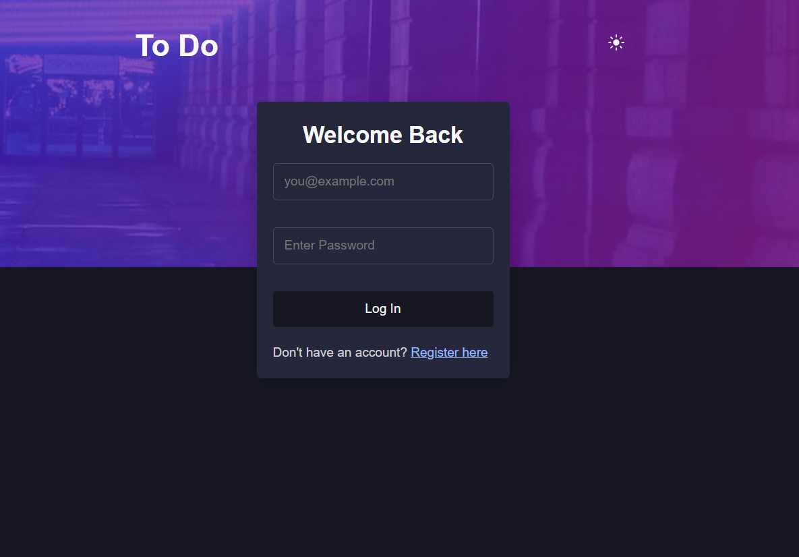
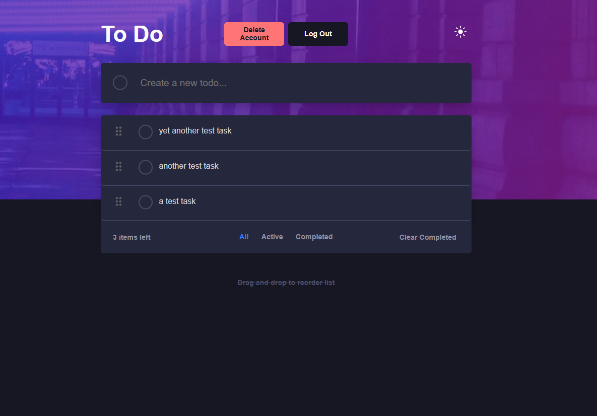

# Frontend Mentor - Todo app solution

This is a solution to the [Todo app challenge on Frontend Mentor](https://www.frontendmentor.io/challenges/todo-app-Su1_KokOW). Frontend Mentor challenges help you improve your coding skills by building realistic projects.

## Table of contents

- [Overview](#overview)
  - [The challenge](#the-challenge)
  - [Screenshot](#screenshot)
  - [Links](#links)
- [My process](#my-process)
  - [Built with](#built-with)
  - [What I learned](#what-i-learned)
  - [Continued development](#continued-development)
  - [Useful resources](#useful-resources)
  - [AI Collaboration](#ai-collaboration)
- [Author](#author)

## Overview

### The challenge

Users should be able to:

- View the optimal layout for the app depending on their device's screen size
- See hover states for all interactive elements on the page
- Add new todos to the list
- Mark todos as complete
- Delete todos from the list
- Filter by all/active/complete todos
- Clear all completed todos
- Toggle light and dark mode
- **Bonus**: Drag and drop to reorder items on the list (they can but it will not persist, for now)

### Screenshot




### Links

- Solution URL: [Solution URL](https://github.com/MarSkor/to-do-app)
- Live Site URL: [Live site URL](https://to-do-app-silk-eight-69.vercel.app/)

## My process

### Built with

- Semantic HTML5 markup
- Flexbox
- CSS Grid
- Mobile-first workflow
- [Vite](https://vite.dev/)
- [React](https://reactjs.org/) - JS library
- [SCSS](https://sass-lang.com/) - For styles
- [React Hook Form](https://react-hook-form.com/) - Form Management
- [Axios](https://axios-http.com/docs/intro)
- [Drizzle](https://orm.drizzle.team/)
- Backend (Express.js + Node.js):
- [Neon](https://neon.com/) - Database (Serverless Postgres)

- [Backend Code](https://github.com/MarSkor/to-dos-backend)

- Backend hosted on [Railway](https://railway.com/)
- Frontend hosted on [Vercel](https://vercel.com/)

### What I learned

I've learnt to connect the frontend with the backend (Node.js, Express.js, Neon DB). I haven't built a lot with a backend so it's been fun slowly learning more about it. Though I've merely scratched the surface of it, I've learnt backend validation and setting a simple app up and hosting it on Railway.

As I was figuring out how to implement the "add new to do" function, I realized for future development, pagination data could be useful to have because a long list with to-dos that you have to scroll far down to reach is not particularly user friendly. So I made it into a 10 per page and also set a limit to how many active tasks a user can have (40). I also implemented log out and let the user be able to delete their account - which is important being able to do.

Drag and drop turned out to be harder than expected, so for now the user can still drag and drop but the item will not keep their new position on refresh. In the frontend mentor design there's no indicator of being able to drag and drop it so I added that as well. Also because it caused some issues when making the user being able to edit their to-dos, so each item having its own 'visible' drag handle worked much better and seems more user friendly.

I think this onSubmit code is what I'm most proud of.
If user tries to submit empty field -> error. If the post request is successful (201) and we set the new items (updating the state). First adding the newTodo (so this new to-do is at the beginning/at the top of the list) and then you spread the rest of the items. Pagination is also set and checking if it exists. If it does, it increases the count by one. Then in the catch block it handles the errors, be it the limit, validation or server errors.

```js
const onSubmit = async (value) => {
  setGlobalError(null);
  if (isSubmitting || !value.content?.trim()) return;
  try {
    const res = await api.post("/todos", value);
    if (res.status === 201) {
      const newTodo = res.data;
      setItems((prevState) => ({
        ...prevState,
        data: [newTodo, ...prevState.data],
        pagination: {
          ...prevState.pagination,
          totalItems: (prevState.pagination?.totalItems || 0) + 1,
        },
      }));
      toast.success("Task created successfully!");
    }
  } catch (error) {
    if (error.response?.status === 403) {
      const message = error.response.data.message;
      toast.error(message);
      return;
    }

    if (error.response?.data?.errors) {
      error.response.data.errors.forEach((validationError) => {
        setError(validationError.path, {
          type: "server",
          message: validationError.msg,
        });
      });
    } else {
      const message = errorHandler(error);
      setGlobalError(message);
      toast.error(message);
    }
  }
};
```

### Continued development

I want to continue exploring and learning database management. Error handling and display them in a user friendly way (good UX/UI) on the frontend is also something I want to work on. Axios is something I've not used a lot before, merely dipped my toes in, but it was interesting using it for this project and I will continue to look into it and learn. I also want to look more into securing and encrypting and decrypting the to-do's when sending them to the database.

Something I want to implement on this specific project is the drag and drop handling, because as of now, the user can only drag and drop the items but they will not keep their position when the page refreshes.

### Useful resources

- [JSM PERN Project](https://youtu.be/ek7hmv5PVV8?si=2ldlaP11KnoyhtNE) - This tutorial helped me get started with setting up the backend and connecting it to the frontend as well as adding security.
- [Axios Docs](https://axios-http.com/docs/intro) - The docs for axios has been quite helpful.
- [Drizzle Docs](https://orm.drizzle.team/docs/tutorials/drizzle-nextjs-neon) - Drizzle docs overall have some pretty good tutorials and various in their docs that is helpful.

### AI Collaboration

Describe how you used AI tools (if any) during this project. This helps demonstrate your ability to work effectively with AI assistants.

- Google AI Studio - Mainly used for debugging, but also brainstorming a few solutions for editing a to-do (PATCH request) and some for axios error handling.
- Coderabbit.ai in github for code reviews.
- Both worked well. I haven't tried using coderabbit before so it was new but helped solving issues and giving suggestions for my code. (used it for the backend code)

## Author

- Website - [Martine](https://www.martineskorbakk.com/)
- Frontend Mentor - [@MarSkor](https://www.frontendmentor.io/profile/MarSkor)
- Twitter - [@martinedev\_](https://x.com/martinedev_)
